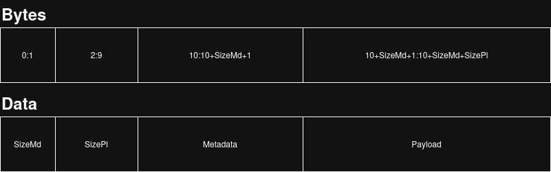

# Rawdog TCP Communication

## Overview

Rawdog is designed to make raw TCP communication easier by adding a simple packet structure that is compatible across platforms. It aims to remove ease the "barrier of entry" for developers who want to add TCP communication to their systems but don't want to come up with a custom protocol or use HTTP or gRPC.

## Packet Transmission

The packet that will be transmitted is broken up into four (4) major sections:

1. Metadata size - 2 bytes (unsigned short)
1. Payload size - 8 bytes (unsigned long long)
1. Metadata - "Metadata Size" bytes
1. Payload - "Payload Size" bytes
